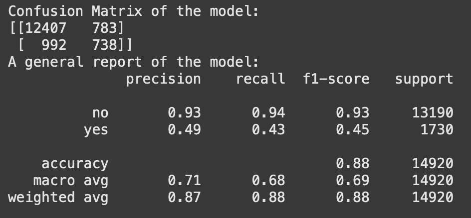

# Tesla Stock Price Prediction using Q-Learning
**Link to Data**:

   - [Tesla Share Price for Last 3 Years](https://www.kaggle.com/datasets/surajjha101/tesla-share-price-for-last-5-years/data)

**Link to the Jupyter Notebook**:
   - [Jupyter Notebook (Milestone3)](./Reinforcement_learning.ipynb)

This project trains an AI agent to trade Tesla stock using Q-learning, a reinforcement learning algorithm, based on historical stock price data from the last five years. The dataset is sourced from [Kaggle](https://www.kaggle.com/datasets/surajjha101/tesla-share-price-for-last-5-years/data).

---

## PEAS/Agent Analysis

- **Performance Measure**: The agent’s performance is measured by the total profit earned from trading Tesla stock. This is the cumulative reward (profit) from buying and selling actions over the dataset.
- **Environment**: The environment consists of historical Tesla stock price data, specifically the closing prices over the last five years. The agent interacts with this static dataset as a sequence of states.
- **Actuators**: The agent can perform three actions: **buy**, **sell**, or **hold**, based on the current state.
- **Sensors**: The agent uses discretized closing prices from the last three days and its current position (holding a share or not) as inputs.

---

## Agent Setup, Data Preprocessing

### Dataset Exploration
The dataset includes Tesla’s daily stock prices with columns like ‘Date’, ‘Open’, ‘High’, ‘Low’, ‘Close’, and ‘Volume’. The **‘Close’** price is the primary focus for defining the trading environment.

#### Important Variables
- **Close**: The closing price of Tesla stock each day, used for buy/sell decisions and reward calculation.
- **Date**: Ensures the data is processed in chronological order.

### Data Preprocessing
1. **Load the Data**: The dataset is imported using pandas.
2. **Extract Closing Prices**: The ‘Close’ column is isolated for analysis.
3. **Discretize Prices**: Closing prices are divided into 10 bins based on quantiles to simplify the state space and make Q-learning feasible.

# Understanding Q-Learning: A Reinforcement Learning Approach

Since Q-learning is not yet covered in class, here is a brief explanation of the Q-learning approach in reinforcement learning.

Q-learning is a powerful reinforcement learning algorithm used to train an agent to make optimal decisions by learning from its interactions with an environment. Below, I’ll break down Q-learning into its key components, mechanics, and implementation, all formatted for direct use in a markdown file.

---

## What is Q-Learning?

Q-learning is a **model-free**, **value-based** reinforcement learning algorithm that enables an agent to learn an optimal policy for decision-making without requiring a model of the environment. It achieves this by estimating the value of taking specific actions in given states, stored in a structure called a **Q-table**.

---

## Key Components of Q-Learning

Here’s how Q-learning structures the problem:

- **States \(s\)**:
  - Represent the agent's current situation or "snapshot" of the environment.
  - Example: In a stock trading scenario, the state might include recent price trends and whether the agent holds a stock.
  
- **Actions \(a\)**:
  - The choices the agent can make in a given state.
  - Example: Buy, sell, or hold a stock.

- **Rewards \(r\)**:
  - Feedback from the environment after taking an action.
  - Positive rewards encourage good actions (e.g., profit from selling), while negative rewards penalize poor choices (e.g., invalid trades).

- **Q-Table**:
  - A table (or array) that stores the **Q-values** for each state-action pair.
  - The Q-value \(Q(s, a)\) represents the expected future reward for taking action \(a\) in state \(s\), assuming the agent follows the optimal policy thereafter.

---

## How Q-Learning Works

Q-learning iteratively updates the Q-table based on the agent's experiences, balancing exploration (trying new actions) and exploitation (using known good actions).

### The Q-Learning Update Rule

The core of Q-learning is its update formula, which refines the Q-values over time:

$$
Q(s_t, a_t) \leftarrow Q(s_t, a_t) + \alpha \left[ r_t + \gamma \max_a Q(s_{t+1}, a) - Q(s_t, a_t) \right]
$$

Where:
- $\(s_t\)$: Current state at time \(t\).
- $\(a_t\)$: Action taken in the current state.
- $\(r_t\)$: Immediate reward received after taking the action.
- $\(s_{t+1}\)$: Next state after the action.
- $\(\alpha\)$: **Learning rate** (0 < \(\alpha\) ≤ 1), controlling how much the Q-value adjusts based on new information.
- $\(\gamma\)$: **Discount factor** (0 ≤ \(\gamma\) < 1), determining the importance of future rewards.
- $\(\max_a Q(s_{t+1}, a)\)$: The maximum Q-value for the next state, representing the best future reward.

This formula balances:
- The current Q-value $\(Q(s_t, a_t)\)$.
- The new information from the reward and future value $\(r_t + \gamma \max_a Q(s_{t+1}, a)\)$.

### Exploration vs. Exploitation

To learn effectively, the agent uses an **epsilon-greedy strategy**:
- With probability $\epsilon$, the agent picks a random action (exploration).
- With probability $1 - \epsilon$, the agent picks the action with the highest Q-value (exploitation).

## Calculating Parameters
As mentioned above, except for the update rule of Q-table given, there are 3 hyperparameters to tune: the learning rate $\alpha$, discount factor $\gamma$, and the exploration probability $\epsilon$. Since my groupmate drops the class without notifying me, I don't have a ton of time to test the hyperparameter on my own, so I do a small-scale, manual grid-search as shown in the notebook.

I will also post relevant figures that I plotted during fine-tuning as below:

## Conclusion
Our first model was relatively successful, earning an accuracy of ~88% on the testing data. As for the fit, we can see from the chart below that it looks like a relatively good fit. Unfortunately we had to terminate the validation testing early due to time constraints but we will optimize that process and return with more data. We will continue to tune our parameters and possibly do some feature engineering to improve further.

We also tested the model with the confusion matrix and obtained a general report.

As you can see from the results of this report, we may have a case of a lazy model. You can see the precision on positive labels is only half of the precision on negative labels, and hence we can gather that the model may be defaulting to classifying a case as negative not because it has learned what a negative entry looks like, but because of the sheer number of negative entries that it is almost always a good bet to classify that way. We will seek to ameliorate that in our future models.
